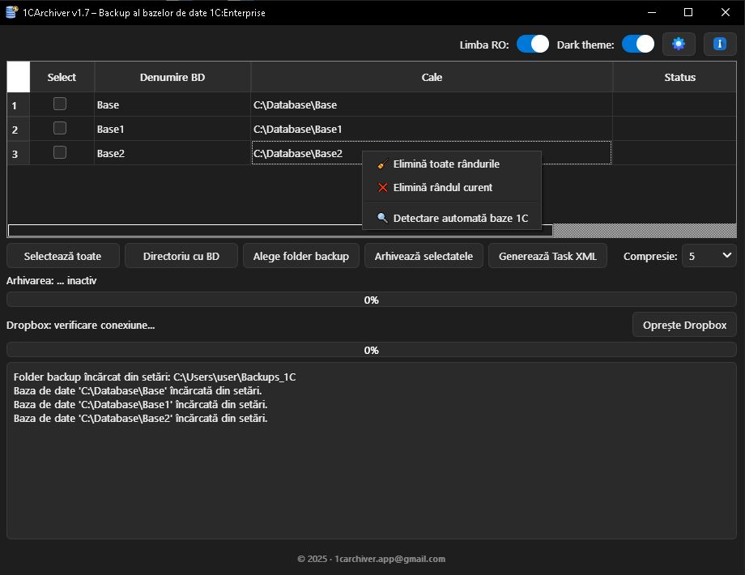

[](https://github.com/sponsors/debalex77)

---

🌐 Website oficial:
https://debalex77.github.io/1CArchiver/

---

## 🌐 Language / Язык
[🇬🇧 English](README.md) | [🇷🇺 Русский](README_RU.md)

---

## 📸 Screenshot



# 1CArchiver  
### Fast & Secure Backup Tool for 1C:Enterprise Databases  

---

## 📌 Overview

**1CArchiver** is a Qt/C++ application designed for fast, reliable, and automated backup of **1C:Enterprise (1С:Предприятие)** file-based databases.  
It can archive the main `1Cv8.1CD` file or the entire database directory, generate SHA-256 checksums, and display real-time compression progress.

The project is built with:

- **Qt 6.9.3 (MSVC 2022)**
- **C++17**
- **[bit7z](https://github.com/rikyoz/bit7z) 4.0.10 (SevenZip SDK)**
- **Windows 64-bit support**

---

## ✨ Features

### 🔐 Archiving & Security
- Create **.7z** archives using **LZMA / LZMA2**
- Adjustable compression level (`0–9`)
- Archive:
  - only the `1Cv8.1CD` file  
  - the entire database directory (extensions mode)
- **Automatic detection of the user's 1C database locations**
- Optional password protection
- Automatic generation of **SHA-256 checksum** files

### 🎛 Modern User Interface
- Built using **Qt Widgets**
- **Light/Dark theme switcher**
- Dynamic translation loading:
  - 🇷🇺 Russian (`ru_RU`)
  - 🇷🇴 Romanian (`ro_RO`)
- Custom-styled tables and progress controls
- QProgressBar and animated spinner during long operations

### ⚙️ Technical Architecture
- Automatic reading and parsing of the 1C configuration file  
  `C:\Users\<user>\AppData\Roaming\1C\1CEStart\ibases.v8i`
- Background worker based on `QThread` (non-blocking UI)
- Real-time progress reporting through bit7z callback (bytes processed)
- Persistent user settings stored in `settings.json`
- Configurable backup folder
- Automatic generation of XML Task files for external scheduling

### 🖥 Professional Installer
- Built using **Qt Installer Framework 4.10**
- Custom icons, logo, and installer artwork
- Creates Desktop and Start Menu shortcuts
- Optional download and installation of **Microsoft Visual C++ Redistributable**
- Automatic SHA-256 checksum generation for installer integrity

---

## 🚀 Getting Started

### 🔧 Requirements
- Windows 10/11 64-bit  
- Qt 6.9.3 (MSVC 2022)  
- Visual Studio Build Tools 2022  
- [7-Zip](https://www.7-zip.org/) installed (for `7z.dll`)  
- [bit7z 4.0.10](https://github.com/rikyoz/bit7z)  

---

## 🔨 Build Instructions

### 1. Clone the repository
```bash
git clone https://github.com/debalex77/1CArchiver.git
cd 1CArchiver
qmake
./release/1CArchiver.exe
```

---

## 📦 Packaging & Installer

To create the installer:
- Install Qt Installer Framework 4.10
- Configure config.xml and package structure under packages/
- Build the installer:
```
binarycreator --config config/config.xml --packages packages 1CArchiverInstaller.exe
```

---

## 🔒 Security Notes

- Password-protected archives use AES-256 encryption ([7-Zip](https://www.7-zip.org/) standard)
- SHA-256 checksum files ensure archive integrity
- No telemetry or external communication of user data

---

## 📖 Documentation

- [User Manual (RO, PDF)](https://github.com/debalex77/1CArchiver/blob/master/docs/1CArchiver-User-Manual-RO.pdf)<br>
- [User Manual (RU, PDF)](https://github.com/debalex77/1CArchiver/blob/master/docs/1CArchiver-User-Manual-RU.pdf)

---

## ⚖️ License

This project is licensed under the **Mozilla Public License 2.0 (MPL-2.0)**.  
See the [LICENSE](LICENSE) file for details.

### Third-party licenses

This project includes third-party components with their own licenses:

- **7-Zip (7z.dll)**  
  Licensed under the **GNU LGPL v2.1**  
  See the [THIRD_PARTY_LICENSES](THIRD_PARTY_LICENSES.txt) file for details.

---

## ❤️ Support

If this project helps you archive or maintain 1C databases,
consider supporting its development via
[GitHub Sponsors](https://github.com/sponsors/debalex77).

Your support helps with:
- maintenance & bug fixing
- new features
- long-term sustainability

